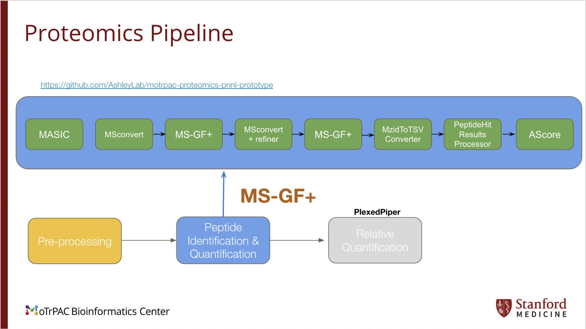

Prototype of PNNL pipeline 
===

___Testing implementation of PNNL pipeline on BIC infrastructure___



Initial documents provided by the PNNL with details of the pipeline (converted to `md` format by the BIC) :

- [PIPELINE](docs/PIPELINE.md)
- [SOFTWARE_SOURCES](docs/SOFTWARE_SOURCES.md)
  
The [scripts](scripts/README.md) directory contains additional files and scripts.


# WORKFLOW

## GLOBAL PROTEOME Test files

Two `raw` files used for testing purposes from the pilot project global protein abundance dataset:

```
MoTrPAC_Pilot_TMT_W_S1_01_12Oct17_Elm_AQ-17-09-02.raw
MoTrPAC_Pilot_TMT_W_S1_02_12Oct17_Elm_AQ-17-09-02.raw
```

## PHOSPHO PROTEOME Test files

Two `raw` files used for testing purposes from the pilot project phospho protein abundance dataset:

```
MoTrPAC_Pilot_TMT_P_S1_01_DIL_28Oct17_Elm_AQ-17-10-03.raw
MoTrPAC_Pilot_TMT_P_S2_01_3Nov17_Elm_AQ-17-10-03.raw
```

## OVERVIEW

| Step | Description                                                                                                                       | Software                      | Input                                         | Output                                                         | Shell Script (Global)                                           | Shell Script (Phospho)                                           |
|------|-----------------------------------------------------------------------------------------------------------------------------------|-------------------------------|-----------------------------------------------|----------------------------------------------------------------|-----------------------------------------------------------------|------------------------------------------------------------------|
| 00   | Extract reporter ion peaks from MS2 spectra and create Selected Ion Chromatograms for each MS/MS parent ion                       | MASIC                         | Thermo .Raw file                              | _ReporterIons.txt and _SICStats.txt (plus several other files) | [`step00masic.sh`](step00/step00masic.sh)                       | [`step00masic_phospho.sh`](step00/step00masic_phospho.sh)        |
| 01   | Convert Thermo .raw files to .mzML files (standard XML file format for MS data)                                                   | MSConvert                     | Thermo .Raw file                              | .mzML file                                                     | [`step01convertRaw.sh`](step01/step01convertRaw.sh)             | [`step01convertRaw_phospho.sh`](step01/step01convertRaw_phospho.sh)             |
| 02   | Identify peptides using a fully tryptic search (for speed); these are used in Step 03                                             | MS-GF+                        | .mzML file and .fasta file                    | .mzid file                                                     | [`step02msgfplus_tryptic.sh`](step02/step02msgfplus_tryptic.sh) | [`step02msgfplus_tryptic_phospho.sh`](step02/step02msgfplus_tryptic_phospho.sh) |
| 03a  | Use mass error histograms to in-silico re-calibrate the m/z values in the .mzML file                                              | mzrefiner filter in MSConvert | .mzid file and .mzML file                     | _FIXED.mzML                                                    | [`step03a.sh`](step03/step03a.sh)                               | [`step03a_phospho.sh`](step03/step03a_phospho.sh)                |
| 03b  | Plot the mass error histograms before and after in-silico recalibration                                                           | PPMErrorCharter               | .mzid file and _FIXED.mzML file               | PNG files                                                      | [`step03b.sh`](step03/step03b.sh)                               | [`step03b_phospho.sh`](step03/step03b_phospho.sh)                |
| 04   | Identify peptides using a partially tryptic search                                                                                | MS-GF+                        | _FIXED.mzML file and .fasta file              | .mzid file                                                     | [`step04msgfplus.sh`](step04/step04msgfplus.sh)                 | [`step04msgfplus_phospho.sh`](step04/step04msgfplus_phospho.sh)  |
| 05   | Create a tab-separated value file listing peptide IDs from step 04                                                                | MzidToTSVConverter            | .mzid file                                    | .tsv file                                                      | [`step05net462.sh`](step05/step05net462.sh)                     | [`step05net462_phospho.sh`](step05/step05net462_phospho.sh)      |
| 06   | Create tab-delimited files required for step 7; files contain peptide IDs, unique sequence info, and residue modification details | PeptideHitResultsProcessor    | .tsv file                                     | _syn.txt file and several related files                        | [`step06phrp.sh`](step06/step06phrp.sh)                         | [`step06phrp_phospho.sh`](step06/step06phrp_phospho.sh)          |
| 07   | Localize the position of Phosphorylation on S, T, and Y residues in phosphopeptides                                               | Ascore                        | _syn.txt files, _FIXED.mzML file, .fasta file | _syn_plus_ascore.txt file                                      |     n/a                                                         | [`step07ascore_phospho.sh`](step07/step07ascore_phospho.sh)      |


## DETAILS

### Notes on containers

[Check this file](build_containers.sh) for details about containers (build, tag, and push to container registry). All the steps described below are based on "interactive" mode. To directly run the scripts in the containers follow the steps on [this file](pipeline_driver.sh). 

### Step 00: MASIC

Build Docker image (one time, or after a new version of MASIC is released):


Start the container (interactive mode)

```
docker run -v $PWD/data:/data:rw -v $PWD/parameters:/parameters:rw -v $PWD/step00:/step00:rw -it motrpac-prot-masic:v1.2_20200901 /bin/bash
```

Run in docker: \
[`step00masic.sh`](step00/step00masic.sh) \
[`step00masic_phospho.sh`](step00/step00masic_phospho.sh)

```
docker exec motrpac-prot-masic step00/step00masic.sh
```


### Step 01: Convert `.raw` to `.mzML` files

[`step01convertRaw.sh`](step01/step01convertRaw.sh) \
[`step01convertRaw_phospho.sh`](step01/step01convertRaw_phospho.sh)

- Input directory/files: `/data/test_global/raw/*.raw`
- Output directory: `msgfplus_input/*.mzML`


### Step 02: Identify peptides using a fully tryptic search

Run on Docker MS-GF+ using the `.mzML` file from `msconvert` (step 1), get a `.mzid` file
  
Run MS-GF+ on Docker container (openjdk). Created a Dockerfile available in directory [`step02`](step02/Dockerfile).

Start the container (interactive mode)

```
docker run -v $PWD/data:/data:rw -v $PWD/parameters:/parameters:rw -v $PWD/step02:/step02:rw -it motrpac-prot-msgfplus:v1.2_20200901  /bin/bash
```

Run in docker: \
[`step02msgfplus_tryptic.sh`](step02/step02msgfplus_tryptic.sh) \
[`step02msgfplus_tryptic_phospho.sh`](step02/step02msgfplus_tryptic_phospho.sh)

- Input directory/files: `/data/test_global/msgfplus_input/`
  + `*.mzML`
  +  `sequence_db.fasta` sequence db
  +  `MSGFPlus_Mods.txt` config file
- Output directory/file: `/data/test_global/msgfplus_output/*.mzid`


### Step 03: Use mass error histograms to in-silico re-calibrate the m/z values

#### A) Run `msconvert` with the mzrefiner option to create a new `.mzML` file named `_FIXED.mzML`

[`step03a.sh`](step03/step03a.sh) \
[`step03a_phospho.sh`](step03/step03a_phospho.sh)

**ISSUE**: msconvert ignores the path to the specified output directory

#### B) Run `PPMErrorCharter` using the `.mzid` file from step 2a and the `_FIXED.mzML` file from step 3a


Start the container:

```
docker run -v $PWD/data:/data:rw -v $PWD/parameters:/parameters:rw -v $PWD/step03:/step03:rw -it motrpac-prot-ppmerror:v1.2_20200901 /bin/bash
```

Run in docker: \
[`step03b.sh`](step03/step03b.sh) \
[`step03b_phospho.sh`](step03/step03b_phospho.sh)
 

### Step 4: Protein Identification and Quantification

Run MS-GF+ using the `_FIXED.mzml` file from Step 3: That creates a `.mzID` file (called it `Dataset_final.mzid`). 

Run the same docker container as in step02

```
docker run -v $PWD/data:/data:rw -v $PWD/parameters:/parameters:rw -v $PWD/step04:/step04:rw -it motrpac-prot-msgfplus:v1.2_20200901  /bin/bash
```

Run in docker: \
[`step04msgfplus.sh`](step04/step04msgfplus.sh) \
[`step04msgfplus_phospho.sh`](step04/step04msgfplus_phospho.sh) 


### Step 5: `MzidToTSVConverter`

Run MzidToTSVConverter to convert `Dataset_final.mzid` to `Dataset.tsv`

Start the container:

```
docker run -v $PWD/data:/data:rw -v $PWD/parameters:/parameters:rw -v $PWD/step05:/step05:rw -it motrpac-prot-mzid2tsv:v1.2_20200901 /bin/bash
```

Run in docker: \
[`step05net462.sh`](step05/step05net462.sh) \
[`step05net462_phospho.sh`](step05/step05net462_phospho.sh)


### Step 6: `PeptideHitResultsProcRunner`

Run PeptideHitResultsProcRunner using the .tsv file from step 5:

Start the container:

```
docker run -v $PWD/data:/data:rw -v $PWD/parameters:/parameters:rw -v $PWD/step06:/step06:rw -it motrpac-prot-phrp:v1.2_20200901 /bin/bash
```

Run in docker: \
`sh` [`step06phrp.sh`](step06/step06phrp.sh) \
`sh` [`step06phrp_phospho.sh`](step06/step06phrp_phospho.sh) 

### Step 7: AScore


Start the container:

```
docker run -v $PWD/data:/data:rw -v $PWD/parameters:/parameters:rw -v $PWD/step07:/step07:rw -it motrpac-prot-ascore:v1.2_20200901 /bin/bash
```

Run in docker: \
[`step07ascore_phospho.sh`](step07/step07ascore_phospho.sh)


## Relative Quantification: PlexedPiper

[PlexedPiper repo](https://github.com/vladpetyuk/PlexedPiper)


Start container:

```
docker run -v $PWD/data:/data:rw -v $PWD/relquant:/relquant:rw  -it motrpac-prot-plexedpiper:v1.2_20200901 /bin/bash
```

Run in docker: \

`sh` [`relquant.sh`](relquant/relquant.sh) \
`sh` [`relquant_phospho.sh`](relquant/relquant_phospho.sh)


# Notes


`MSConvert.exe`: Linux version is available [here](http://proteowizard.sourceforge.net/download.html). Example command line they have using docker:

```
docker run -it --rm -e WINEDEBUG=-all -v /your/data:/data chambm/pwiz-skyline-i-agree-to-the-vendor-licenses wine msconvert /data/file.raw
```

